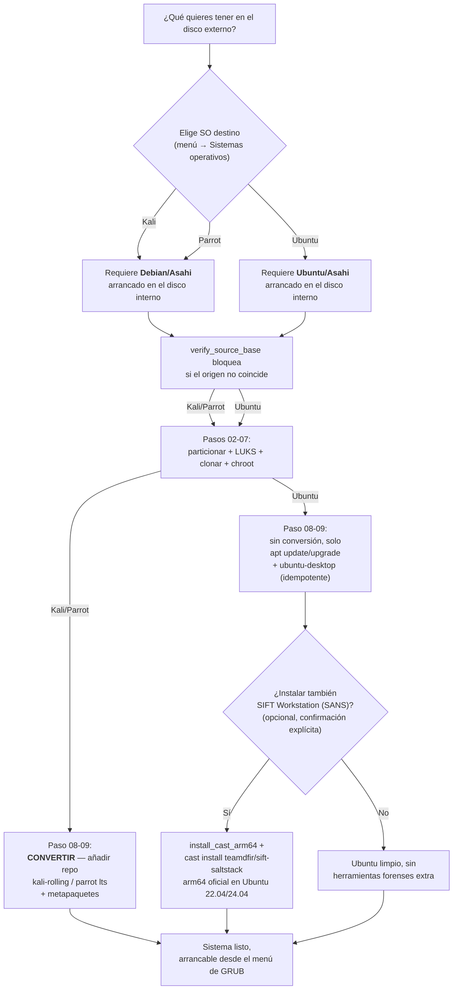

# Offensive Installer Silicon Chip (base_inst_kali)

**[Read this in English → README.en.md](README.en.md)**

Instalador con menú, multiidioma (ES/EN) y soporte para **varios
sistemas operativos ofensivos** (Kali Linux, Parrot Security OS y Ubuntu) en un
disco externo USB con particiones cifradas, clonados a partir de una
base **Debian/Asahi** ya instalada en un MacBook Air/Pro Apple Silicon
(M1/M2). El `/boot` (EFI + kernel) se mantiene en el disco interno del
Mac; el sistema de ficheros raíz vive en el disco externo.

```
Debian/Asahi (NVMe interno, ya instalado) ──clona──▶ disco externo USB
                                                       ├── Kali Linux (particiones propias)
                                                       └── Parrot Security OS (particiones propias)
```

> ⚠️ **Estado del proyecto:** en desarrollo activo. Los scripts son
> funcionales pero no están pensados para un uso "a ciegas". Lee la
> sección de riesgos antes de ejecutar nada.

## Requisito indispensable antes de usar esto

**El MacBook debe tener ya instalado y actualizado, en su disco interno
(NVMe), el sistema operativo base que corresponda al destino que
quieras clonar**, antes de ejecutar nada de este repositorio:

- **Asahi Linux / Debian** — para clonar hacia **Kali** o **Parrot**
  (se convierten añadiendo su repositorio sobre esta base).
- **Ubuntu Asahi** — para clonar hacia **Ubuntu** (se clona tal cual,
  sin conversión; ver [ubuntuasahi.org](https://ubuntuasahi.org/)).

Este proyecto **no instala macOS ni ninguna de estas bases**: parte de
que ya existen y funcionan, y clona la que corresponda hacia un disco
externo. El instalador comprueba automáticamente, antes de particionar
o clonar, que el sistema arrancado coincide con el que necesita el
destino elegido (ver
[docs/es/SISTEMAS_OPERATIVOS.md](docs/es/SISTEMAS_OPERATIVOS.md)).

Sigue la guía oficial si todavía no la tienes:
<https://wiki.debian.org/InstallingDebianOn/Apple/M1> (proyecto Bananas
de Debian, basado en el trabajo de Asahi Linux). El paso `00` de este
instalador comprueba indicios de esa instalación (arquitectura arm64,
paquetes `asahi-*`) y te avisa si no los encuentra, pero la
responsabilidad de tener esa base lista y actualizada es previa a usar
este repositorio.

## Qué hace este proyecto

Automatiza y encadena un flujo que hoy exige combinar varias guías
sueltas y bastante prueba-error manual:

- Comprueba los prerrequisitos y particiona, cifra (LUKS) y formatea un
  **disco externo USB**.
- **Clona** el sistema en marcha (Debian/Asahi o Ubuntu/Asahi, según el
  destino elegido) a ese disco externo.
- Añade los repositorios y metapaquetes de **Kali Linux** y/o **Parrot
  Security OS** sobre esa base clonada, usando los mecanismos oficiales
  de cada distribución, convirtiéndola en una distribución de pentesting
  completa arrancable desde el menú de GRUB junto al sistema original.
  **Ubuntu**, en cambio, se clona tal cual (sin conversión), con la
  opción de añadir encima **SIFT Workstation (SANS)** para forense.
- Permite instalar **más de un sistema ofensivo en el mismo disco
  externo**, cada uno en sus propias particiones, sin pisar los datos de
  los demás.
- Todo ello guiado por un **menú único** (`install.sh`) con progreso
  persistente (sobrevive a los múltiples reinicios que exige el
  proceso), **logging** por paso, y textos en **castellano e inglés**.

## Diagrama de decisión: qué sistema operativo elegir



> Herramientas forenses evaluadas para Ubuntu más allá de SIFT (CAINE,
> REMnux) tienen su propio veredicto detallado en
> [docs/es/SISTEMAS_OPERATIVOS.md](docs/es/SISTEMAS_OPERATIVOS.md#herramientas-forenses-investigadas-para-ubuntu-veredicto).

## Requisitos

- MacBook con chip Apple M1 o M2, con Asahi Linux/Debian ya instalado y
  actualizado (ver arriba).
- Disco duro/SSD externo con espacio suficiente (se recomiendan 60 GB o
  más por cada sistema operativo que instales).
- Conexión a internet estable durante todo el proceso.
- Copia de seguridad completa de tus datos antes de empezar (ver Riesgos).
- **Conocimientos profundos de administración y operación de sistemas
  Linux** (particionado, LVM, LUKS, chroot, GRUB, gestión de paquetes
  APT). Este NO es un instalador pensado para quien se inicia en Linux:
  cualquier paso mal entendido puede dejar el Mac sin arrancar. Si algún
  término de los anteriores no te resulta familiar, fórmate primero
  antes de tocar el disco interno o el externo.

## ⚠️ Riesgos y advertencias

- Este proceso modifica el particionado y el firmware de arranque del
  disco externo, y añade entradas al `grub.cfg` del sistema interno. Un
  fallo durante estos pasos puede impedir temporal o permanentemente que
  el sistema arranque correctamente.
- **Haz tantas copias de seguridad de tu macOS como sean necesarias**
  antes de empezar (Time Machine y, si es posible, un clon completo del
  disco con una herramienta como Carbon Copy Cloner o SuperDuper). No se
  trata de "una copia por si acaso": repite las copias en distintos
  destinos si el equipo contiene datos que no puedes permitirte perder,
  y verifica que son restaurables antes de empezar, no después.
- **Comprueba tú mismo que la versión de la base Debian/Asahi que tienes
  instalada es compatible con la versión de Kali Linux o Parrot OS que
  vayas a instalar.** Este instalador añade los repositorios de Kali
  (`kali-rolling`) o de Parrot (`lts`) sobre la base Debian que ya
  tengas; si esa base es demasiado antigua, demasiado nueva, o no
  corresponde a la que cada distribución espera como origen, el
  `dist-upgrade` de los pasos 08-09 puede dejar el sistema en un estado
  roto o a medio actualizar. Revisa la documentación oficial de Kali y
  de Parrot sobre requisitos de la base antes de lanzar esos pasos, y no
  asumas que "la última versión de Debian disponible" es automáticamente
  la correcta.
- Todavía no hay un desinstalador automático. Revertir los cambios exige
  edición manual de particiones.
- Usa este proyecto bajo tu propia responsabilidad. Recomendado solo en
  máquinas de prueba o con una copia de seguridad completa y verificada.

## Empezar

```bash
git clone https://github.com/securizart/offensive-installer-silicon-chip.git
cd offensive-installer-silicon-chip
sudo bash install.sh
```

Documentación completa (arquitectura, guía de uso paso a paso, gestión
de varios sistemas operativos, resolución de problemas):

| Documento | Castellano | English |
|---|---|---|
| Arquitectura | [docs/es/ARQUITECTURA.md](docs/es/ARQUITECTURA.md) | [docs/en/ARCHITECTURE.md](docs/en/ARCHITECTURE.md) |
| Guía de uso | [docs/es/GUIA_USO.md](docs/es/GUIA_USO.md) | [docs/en/USAGE.md](docs/en/USAGE.md) |
| Varios sistemas operativos | [docs/es/SISTEMAS_OPERATIVOS.md](docs/es/SISTEMAS_OPERATIVOS.md) | [docs/en/OPERATING_SYSTEMS.md](docs/en/OPERATING_SYSTEMS.md) |
| Resolución de problemas | [docs/es/TROUBLESHOOTING.md](docs/es/TROUBLESHOOTING.md) | [docs/en/TROUBLESHOOTING.md](docs/en/TROUBLESHOOTING.md) |

Otros ficheros del repositorio: [CHANGELOG.md](CHANGELOG.md) ·
[CONTRIBUTING.md](CONTRIBUTING.md) ([English](CONTRIBUTING.en.md)) ·
[LICENSE](LICENSE)

## Estructura del repositorio

```
install.sh          menú principal (ejecutar siempre desde aquí)
lib/
  common.sh           logging, set -e/trap, confirmaciones destructivas
  i18n.sh             motor de traducción: t clave arg1 arg2...
  ui.sh               whiptail con fallback a texto plano
  state.sh            progreso persistente (global y por SO)
  os_catalog.sh        catálogo de sistemas operativos soportados
i18n/
  strings.es.sh        textos en castellano
  strings.en.sh        textos en inglés
steps/
  00_check_prerreq.sh          host, una vez: prerrequisitos + disco
  01_preparacion.sh            host, una vez: paquetes base + usuario
  01a_network.sh               host, una vez: WiFi
  02_particiones.sh            por SO: particionar
  03_formateo.sh                por SO: LUKS + LVM + mkfs
  04_clonado.sh                 por SO: clonar el sistema actual
  05_chroot_prep.sh             por SO: montar + chroot
  06_grub_finiquitar.sh         por SO: GRUB (dentro del chroot)
  07_fusion_grub.sh             por SO: fusionar grub.cfg
  08_repositorios.sh            por SO: repos de Kali o Parrot
  09_instalacion_paquetes.sh    por SO: metapaquetes de Kali o Parrot
logs/
  install.log                  log maestro
  paso_<id>_<fecha>.log        log detallado de cada ejecución
docs/
  es/, en/                     documentación detallada (ver tabla arriba)
```

Para el detalle de por qué los pasos están divididos en "de host" (una
vez) y "por sistema operativo" (repetibles), y cómo el estado de
progreso viaja entre el sistema original, el chroot y el sistema
clonado ya arrancado, ver
[docs/es/ARQUITECTURA.md](docs/es/ARQUITECTURA.md).

## Añadir un sistema operativo nuevo al catálogo

Ver [docs/es/SISTEMAS_OPERATIVOS.md](docs/es/SISTEMAS_OPERATIVOS.md) —
en resumen: añadir su id a `lib/os_catalog.sh`, sus textos a
`i18n/strings.*.sh`, y su rama de repos/metapaquetes en
`steps/08_repositorios.sh` y `steps/09_instalacion_paquetes.sh`. El
resto del framework (menú, particionado, clonado, GRUB) es genérico y no
hay que tocarlo.

## Compatibilidad probada

| Modelo | Estado |
|---|---|
| MacBook Air M1 | ✅ Probado (Kali y Parrot) |
| MacBook Air M2 | ✅ Probado (Kali y Parrot) |
| MacBook Pro M1 | Por probar |
| MacBook Pro M2 | Por probar |

Actualiza esta tabla según se vaya confirmando en los `Issues` del
repositorio.

> Si el firmware/u-boot no detecta el disco externo al arrancar, ver
> ["El firmware no detecta el disco externo al arrancar"](docs/es/TROUBLESHOOTING.md#el-firmware-no-detecta-el-disco-externo-al-arrancar)
> en la guía de resolución de problemas.

## Demo en vídeo

[](https://youtu.be/JsPsCAa4XBU)

▶️ **[Ver en YouTube](https://youtu.be/JsPsCAa4XBU)**

En el vídeo también se puede comprobar la instalación y el uso de
**Ubuntu** sobre esta misma base, a modo de prueba de concepto — ver la
hoja de ruta más abajo.

## Hoja de ruta

- **Próxima versión: cobertura explícita de "distros forenses"**, no
  solo herramientas sueltas sobre Ubuntu. Además de rematar la
  investigación de REMnux (ver más abajo), evaluar con la misma
  metodología (comprobación real de disponibilidad arm64, no dar nada
  por hecho) otras distribuciones forenses de referencia — p. ej.
  Tsurugi Linux, DEFT/DEFT Zero — y documentar en
  `docs/es/SISTEMAS_OPERATIVOS.md` un veredicto explícito para cada una
  (soportada, en duda, o descartada y por qué), siguiendo el mismo
  formato ya usado con CAINE/SIFT/REMnux.
- ~~Ubuntu como tercer sistema operativo instalable~~ — **implementado**:
  `ubuntu` ya está en el catálogo (`lib/os_catalog.sh`), clonado tal
  cual desde una instalación de Ubuntu/Asahi genuina (sin conversión,
  a diferencia de Kali/Parrot). Incluye instalación idempotente de
  `ubuntu-desktop` y, como opción, **SIFT Workstation (SANS)** — soporte
  arm64 oficial confirmado en Ubuntu 22.04/24.04. Ver
  [docs/es/SISTEMAS_OPERATIVOS.md](docs/es/SISTEMAS_OPERATIVOS.md) para
  el detalle completo, incluido por qué se descartaron CAINE y REMnux.
- Próximo: seguir puliendo la integración de Parrot OS (su soporte
  arm64 sigue siendo menos maduro que el de Kali) y evaluar más
  herramientas forenses sobre la base Ubuntu ya disponible.
- **REMnux, en investigación (no descartado del todo)**: una
  comparación directa de sus `.sls` con los de SIFT (que sí tiene
  soporte arm64 oficial) muestra que el mecanismo central de REMnux
  (repo vía PPA de Launchpad, bootstrap de `cast` ya arm64-aware) no
  tiene el mismo problema estructural que había en SIFT, pero sí una
  categoría de riesgo distinta: herramientas dependientes de Wine
  (soporte arm64 inmaduro) y binarios de terceros publicados solo en
  amd64 (p. ej. PolarProxy). Plan: probar `cast install --mode=addon`
  con un subconjunto de `.sls` sin dependencias de Wine para medir qué
  fracción real funciona, antes de decidir si se integra como opción
  en el paso 09 (igual que SIFT) o se documenta como "no soportado".
  Ver [docs/es/SISTEMAS_OPERATIVOS.md](docs/es/SISTEMAS_OPERATIVOS.md).

## Trabajo previo / Créditos

Este proyecto no parte de cero: se apoya en y da crédito a trabajo
previo de la comunidad, entre otros:

- [AsahiLinux/asahi-installer](https://github.com/AsahiLinux/asahi-installer) —
  el instalador base de Linux para Apple Silicon.
- [kali-asahi](https://github.com/allamiro/kali-asahi) — imagen nativa
  de Kali para Apple Silicon.
- Documentación oficial de Kali sobre
  [repositorios APT](https://www.kali.org/docs/general-use/kali-apt-sources/)
  y metapaquetes (`kali-linux-headless`, `kali-linux-everything`).
- [Debian Conversion Script de ParrotSec](https://gitlab.com/parrotsec/project/debian-conversion-script) —
  el script oficial del equipo de Parrot para convertir una base Debian.
- La guía de [Void Linux en Apple Silicon](https://docs.voidlinux.org/installation/guides/arm-devices/apple-silicon.html),
  usada como referencia para el patrón de partición externa con
  `/boot/efi` interno.
- La guía de Debian para Apple Silicon
  (<https://wiki.debian.org/InstallingDebianOn/Apple/M1>, proyecto
  Bananas), como referencia del prerrequisito de base Asahi/Debian.

**Lo que este proyecto añade sobre lo anterior:** integra y automatiza en
un único flujo repetible, con menú, progreso persistente, logging e
idioma configurable, pasos que antes estaban dispersos en guías
independientes — y permite instalar **varios sistemas ofensivos a la
vez** en el mismo disco externo, sin colisionar entre ellos.

## Aviso legal y uso ético

Este proyecto instala herramientas orientadas a pentesting y seguridad
ofensiva (Kali Linux, Parrot Security OS). Su uso está permitido
**únicamente** en sistemas de tu propiedad o para los que tengas
autorización explícita del propietario. El uso de estas herramientas
contra sistemas de terceros sin autorización puede ser ilegal según la
jurisdicción; el autor no se hace responsable del mal uso de las
herramientas instaladas a través de este proyecto.

## Licencia

Distribuido bajo licencia GPLv3. Ver el fichero [LICENSE](LICENSE).

## Contribuir

Las contribuciones son bienvenidas. Abre un Issue para reportar
problemas o una Pull Request para mejoras. Ver
[CONTRIBUTING.md](CONTRIBUTING.md).
