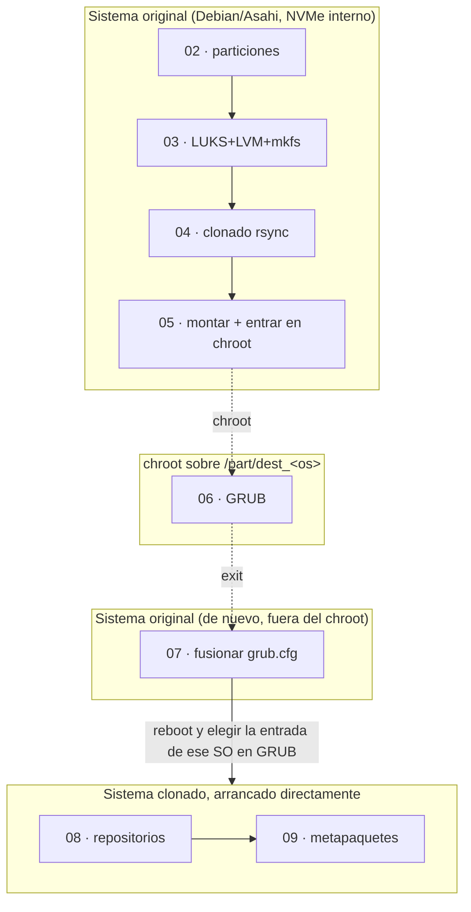

# Arquitectura — base_inst_kali

## Objetivo del proyecto

Convertir un disco externo USB en una instalación de **Kali Linux** y/o
**Parrot OS** (arm64), clonada a partir de una base **Debian/Asahi** ya
instalada y actualizada en el disco interno (NVMe) de un MacBook Air
Apple Silicon, siguiendo el método descrito en
<https://wiki.debian.org/InstallingDebianOn/Apple/M1> (proyecto Bananas).
El disco externo puede alojar **varios sistemas ofensivos a la vez**, en
particiones independientes.

> **Requisito previo, no negociable**: el MacBook debe tener ya Asahi
> Linux/Debian instalado y actualizado en el NVMe interno. Este
> repositorio no lo instala; parte de que ya existe. Ver el README para
> el enlace a la guía oficial.

Este framework envuelve el proceso en:

- un **menú único** (`install.sh`) con progreso persistente,
- **logging** por paso y un log maestro,
- **i18n** en castellano/inglés,
- una capa de **UI** (`whiptail` con fallback a texto plano),
- un **catálogo de sistemas operativos** (`lib/os_catalog.sh`) que
  permite añadir Kali, Parrot, u otros, sin tocar el resto del código.

## Dos categorías de pasos: "de host" y "por sistema operativo"

Con más de un SO en el mismo disco, no todos los pasos tienen sentido
"una sola vez". Por eso se dividen en dos grupos:

| Grupo | Pasos | Cuándo se hacen |
|---|---|---|
| **Host** | 00, 01, 01a | Una sola vez. No dependen de qué SO(s) vayas a clonar. |
| **Por SO** | 02–09 | Se repiten **por cada sistema operativo** que instales en el disco. Cada uno lleva su propio progreso, sus propias particiones, su propio grupo LVM, etc. |

El estado de los pasos de host se guarda con claves simples
(`STEP_00_STATUS`, ...). El estado de los pasos por SO se guarda
namespaceado por el id del sistema operativo (`OS_kali_STEP_02_STATUS`,
`OS_parrot_STEP_02_STATUS`, ...), de forma que el progreso de Kali y el
de Parrot nunca se pisan entre sí (`lib/state.sh`, funciones `os_*`).

El menú (`install.sh`) mantiene un "sistema operativo activo"
(`ACTIVE_OS` en el estado): los pasos 02–09 que ves y ejecutas en cada
momento son siempre los del SO activo. Cambiar de SO activo (opción
"Sistemas operativos" del menú) no borra el progreso de ninguno; solo
cambia cuál se muestra/ejecuta.

## Particionado sin colisiones entre sistemas operativos

Los tres primeros scripts originales asumían un disco vacío y creaban
siempre las particiones 1, 2 y 3. Con varios sistemas operativos en el
mismo disco eso ya no vale: el paso 02 calcula, la primera vez que se
ejecuta para un SO dado, cuáles son los siguientes números de partición
libres en el disco (`sgdisk -p` + el número de partición más alto ya
existente), y los guarda (`os_state_set $OS PART_EFI/PART_BOOT/PART_ROOT`)
para reutilizarlos en pasos posteriores o si hay que reintentar. Así, si
Kali ocupa las particiones 1-3, Parrot pasará automáticamente a ocupar
la 4-6, sin que haga falta indicarlo a mano.

Del mismo modo, `lib/os_catalog.sh` deriva de forma determinista, a
partir del id del sistema operativo:

| Elemento | Ejemplo para `kali` | Ejemplo para `parrot` |
|---|---|---|
| Etiqueta partición EFI (máx. 11 car. FAT) | `EFI-KALI` | `EFI-PARROT` |
| Etiqueta partición boot | `boot_kali` | `boot_parrot` |
| Etiqueta partición root | `rootfs_kali` | `rootfs_parrot` |
| Grupo de volúmenes LVM | `vgkali` | `vgparrot` |
| Nombre del mapper LUKS | `kali_root_crypt` | `parrot_root_crypt` |
| Punto de montaje temporal | `/part/dest_kali` | `/part/dest_parrot` |

Esto evita cualquier colisión de nombres si en algún momento ambos
sistemas están montados o abiertos a la vez (por ejemplo, al fusionar
`grub.cfg` de uno justo después de haber trabajado en el otro).

## Tres entornos de ejecución distintos (por cada SO)

Para un SO dado, sus pasos 02-09 no se ejecutan todos en el mismo
sistema operativo en marcha. Hay tres contextos:

- **02–05**: se ejecutan arrancado con el sistema Debian/Asahi normal del
  Mac. El disco externo solo se monta en `/part/dest_<os>`, no se
  arranca.
- **06**: se ejecuta *dentro* del `chroot` que abre el paso 05. Su
  `BASE_DIR` resuelve a `/base_inst_kali_installer` (copia completa del
  proyecto que hace el paso 05 con `rsync`), no a la ruta original del
  host.
- **07**: de nuevo en el host, tras salir del chroot con `exit`. El
  disco externo sigue montado en `/part/dest_<os>` en este punto.
- **08–09**: se ejecutan habiendo **arrancado ya ese sistema clonado**
  directamente desde el disco externo (eligiendo esa entrada en el menú
  de GRUB tras el reinicio del paso 07). Es un proceso distinto, con su
  propio `/var/lib/base_inst_kali/state.conf`.

### Por qué el estado necesita sincronizarse a mano entre entornos

`state_get`/`state_set` leen y escriben siempre
`/var/lib/base_inst_kali/state.conf` **del sistema de ficheros en el que
se ejecuta el script en ese momento**. Como hay tres "vistas" distintas
del disco (host, chroot, sistema clonado ya arrancado), sin ayuda ese
fichero no sería el mismo en las tres:

- El paso 05 monta el disco externo en `/part/dest_<os>` y copia allí
  todo el proyecto — a partir de ese momento, escribir en
  `/var/lib/...` desde dentro del `chroot` **es lo mismo** que escribir
  en `/part/dest_<os>/var/lib/...` desde fuera, porque es el mismo
  filesystem montado. Por eso el paso 06 sí puede marcar su propio
  progreso de forma consistente con lo que verá el sistema clonado al
  arrancar.
- Pero el paso 07 corre en el **host**, no en el chroot, así que sus
  `mark_os_step_done` escriben en el `/var/lib/...` del host, no en el
  del disco externo. Por eso, al final de los pasos 04 y 07 se llama
  explícitamente a `sync_state_to_mount /part/dest_<os>`
  (`lib/state.sh`): copia el `state.conf` actual del host dentro del
  disco externo montado, para que cuando arranques desde ese disco
  (pasos 08–09) el instalador recuerde qué se hizo antes — incluido, de
  paso, el progreso de *otros* sistemas operativos que hubiera en el
  mismo disco (información inofensiva de más, no afecta al SO que
  arranca).

### Por qué el paso 06 no bloquea el menú del host

El menú principal calcula qué paso "toca" mirando el `state.conf` **del
host**. Como el paso 06 escribe su marca en el filesystem del chroot
(que en ese momento coincide con `/part/dest_<os>`, no con la raíz del
host), el host nunca verá ese "hecho" reflejado en su propio estado. Por
eso `install.sh` mantiene `NO_GATE_STEPS=("06")`: el paso 07 no se
bloquea esperando una marca que nunca va a aparecer en el host.

## Fusión de `grub.cfg` con varios sistemas operativos

El paso 07 ejecuta `update-grub` en el host antes de fusionar, lo que
**regenera desde cero** el `grub.cfg` del host. Si ya habías fusionado
antes la entrada de otro SO (p. ej. Kali) y ahora hay una copia bien
formada de ese sistema en el disco (con su propio `fstab`), es muy
probable que `os-prober` la detecte automáticamente y la vuelva a añadir
— como una entrada "chainload" genérica, no la nativa que este script
construye a mano. El SO que se procesa *en ese momento* sí recibe la
entrada nativa completa, con los parámetros de kernel correctos.
Comprueba el menú de arranque después de añadir un segundo sistema para
confirmar que ambas entradas siguen presentes.

## Módulos (`lib/`)

| Fichero | Responsabilidad |
|---|---|
| `state.sh` | Persistencia de progreso e idioma. Funciones globales (`state_get/set`, `mark_step_done`, `step_status`) para los pasos de host, y namespaceadas por SO (`os_state_get/set`, `mark_os_step_done`, `os_step_status`, `os_list_add/get`) para los pasos 02-09. `sync_state_to_mount` copia el estado al disco externo montado. |
| `os_catalog.sh` | Lista de sistemas operativos soportados (`SUPPORTED_OS`) y funciones que derivan nombres de partición/VG/mapper/mountpoint a partir del id del SO. Punto único para añadir un sistema operativo nuevo (ver `docs/es/SISTEMAS_OPERATIVOS.md`). |
| `i18n.sh` | Motor de traducción. `i18n_load <es\|en>` carga `i18n/strings.<lang>.sh` en el array asociativo `STRINGS[]`. `t clave arg...` traduce e interpola con `printf`. |
| `ui.sh` | Abstracción de interfaz: `ui_msgbox`, `ui_yesno`, `ui_inputbox`, `ui_passwordbox`, `ui_menu`. Detecta si `whiptail` está instalado y cae a `read`/`echo` si no (ver más abajo). |
| `common.sh` | `set -e -u -o pipefail` + `trap ERR`, logging (`log_info/warn/error/ok`, `init_step_log`, `run_cmd`), `require_root`, `confirm_yes_no`, `confirm_destructive`, `pause_enter`. |

## Whiptail: cuándo se usa y cuándo no

- No hay ningún bootstrap que instale `whiptail` a la fuerza. En los
  pasos 00 y 01 (antes de que exista en el sistema) todo funciona en
  modo texto de forma natural.
- El paso 01 lo añade a la lista de paquetes base (`apt install ...
  whiptail`).
- A partir del paso 01a, cada script vuelve a comprobar si está
  disponible (`ui_detect_mode`) y usa diálogos automáticamente si es así.
- La salida en bruto de comandos largos (`apt`, `rsync`, `cryptsetup`,
  `sgdisk`...) **nunca** pasa por whiptail — se deja como salida de
  terminal normal, porque meterla en una caja de diálogo rompería la
  visibilidad del progreso real. `pause_enter` tampoco usa whiptail por
  el mismo motivo.

## Convenciones a mantener si se añaden pasos o sistemas operativos nuevos

1. Cualquier operación irreversible sobre un disco (particionar,
   formatear, `luksFormat`) debe pasar por `confirm_destructive`.
2. Ningún dato sensible (contraseñas, passphrases) se debe escribir
   fuera de los ficheros de configuración del propio sistema, y esos
   ficheros deben quedar con permisos `600`.
3. Todo comando que pueda fallar debe ir envuelto en
   `run_cmd "descripción" comando...`.
4. Cualquier `grep`/`awk` cuyo resultado se vaya a usar en una
   asignación de variable debe tener en cuenta que, con `pipefail`
   activo, "no encontrar nada" hace fallar la línea — añade `|| true`
   cuando "vacío" sea un resultado válido y compruébalo explícitamente
   después.
5. Cualquier nombre derivado del sistema operativo (partición, VG,
   mapper, mountpoint) debe salir de `lib/os_catalog.sh`, nunca
   hardcodeado, para que convivan varios sistemas sin colisionar.
